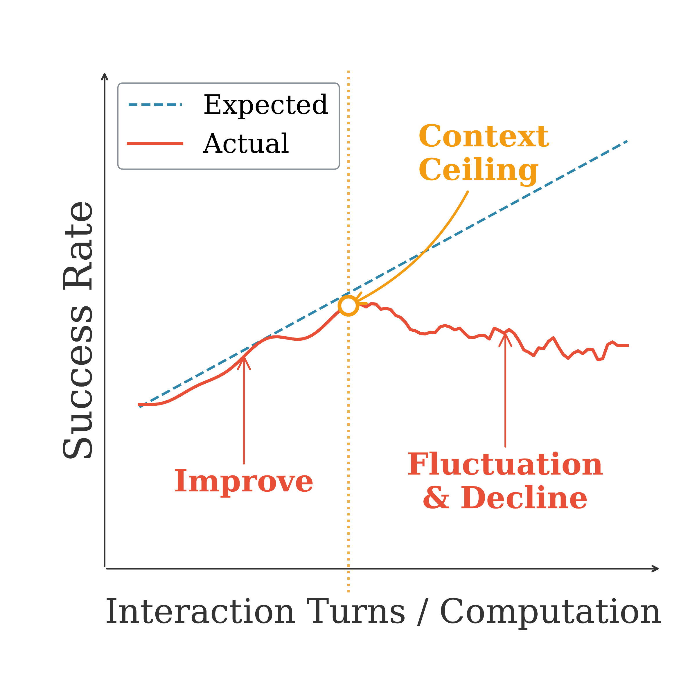
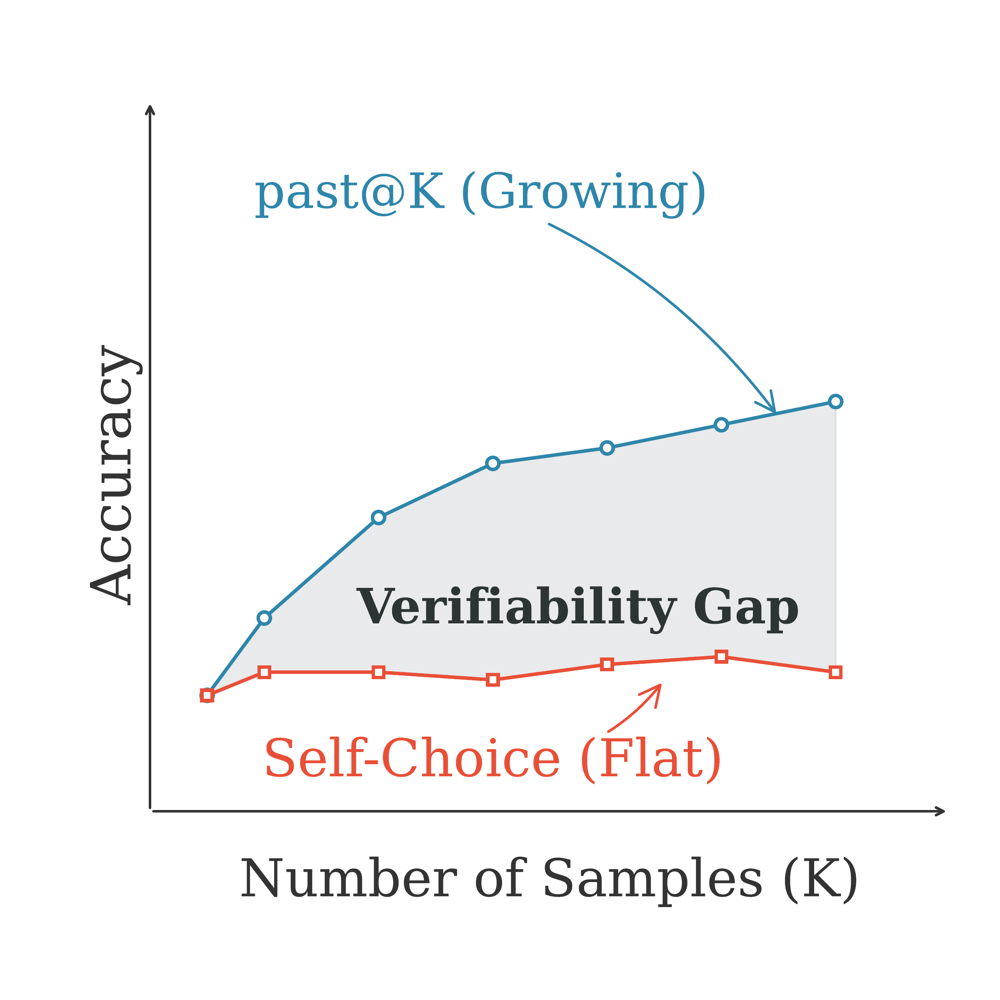
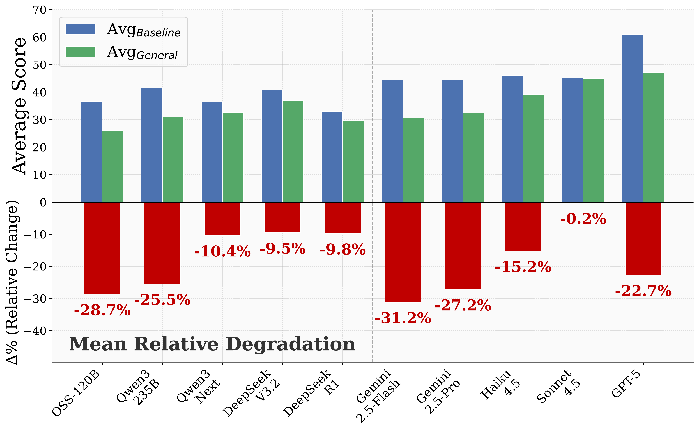

<h1 align="center">
Benchmark Test-Time Scaling of General LLM Agents
</h1>

Anonymous Authors

## ❓ Is Test-Time Scaling as Effective as You Think?

<table align="center">
  <tr>
    <td align="center"> <b>(a)</b> Sequential test-time scaling</td>
    <td align="center"> <b>(b)</b> Parallel test-time scaling</td>
  </tr>
</table>

- **Sequential scaling** hits a **context ceiling**: performance initially improves with more interaction turns, but then plateaus and even declines as the growing context destabilizes the agent.
- **Parallel scaling** suffers from a **verifiability gap**: while pass@K grows steadily with more samples, self-choice accuracy remains nearly flat — agents cannot reliably identify the correct trajectory among candidates.

## 🔍 Overview

- We introduce **General AgentBench**, a benchmark that provides a unified framework for evaluating general LLM agents across search, coding, reasoning, and tool-use domains. Evaluation of ten leading LLM agents reveals a substantial performance degradation when moving from domain-specific evaluations to this general-agent setting.

   
  
Performance comparison between specialized-agent and general-agent settings. 
  <b>Top:</b> Absolute performance. <b>Bottom:</b> Relative performance degradation under the general-agent setting.

- Using General AgentBench, we systematically study test-time scaling behaviors under **sequential scaling** (iterative interaction) and **parallel scaling** (sampling multiple trajectories).  We find that neither scaling methodology yields effective performance improvements in practice, due to two fundamental limitations: **context ceiling** in sequential scaling and **verification gap** in parallel scaling.

## 🏗️ Repository Structure

| Directory                  | Description                                                                                                           |
| -------------------------- | --------------------------------------------------------------------------------------------------------------------- |
| `general_agent/`           | General agent system — unified MCP-based framework that connects a single agent to all benchmark tools simultaneously |
| `benchmarks/`              | Individual benchmark implementations (tau2-bench, mcp-bench, swebench, terminalbench, mathhay, deepresearch, etc.)    |
| `benchmarks/instructions/` | Setup and running guides for each individual benchmark                                                                |

## ✅ Getting Started

- **Run the general agent system:** see [general_agent/scripts/](general_agent/scripts/) for experiment scripts and [general_agent/README.md](general_agent/README.md) for details.
- **Run individual benchmarks independently:** see [benchmarks/instructions/](benchmarks/instructions/) for per-benchmark setup and usage guides.

## 🎁 API Sources

General AgentBench may call external APIs for (1) LLM inference and (2) benchmark tools.

### LLM inference (via LiteLLM)

We use LiteLLM-style model strings (a.k.a. “model routes”) to specify which API/provider a run uses. If a single model has multiple routes listed, it means we have used all of those routes in different runs/stages.

| Model             | Source                                                                |
| ----------------- | --------------------------------------------------------------------- |
| Qwen3-235B        | AWS Bedrock                                                           |
| Qwen3-Next        | Hugging Face via Together (gateway)                                   |
| OpenAI-oss-120B   | Hugging Face via Novita (gateway)                                     |
| Gemini-2.5-Flash  | Google Gemini API                                                     |
| Gemini-2.5-Pro    | Google Gemini API                                                     |
| Claude-Haiku-4.5  | AWS Bedrock (Anthropic)                                               |
| Claude-Sonnet-4.5 | AWS Bedrock (Anthropic)                                               |
| DeepSeek-R1       | Hugging Face via Novita + Together (gateways)                         |
| DeepSeek-V3.2     | Hugging Face via Novita + Fireworks (gateways) + AWS Bedrock Converse |
| GPT-5             | OpenAI API                                                            |

For the exact LiteLLM model routes used in experiments, see [general_agent/scripts/models.py](general_agent/scripts/models.py).

### Tooling APIs

| Benchmark | External API                       |
| --------- | ---------------------------------- |
| `search`  | Serper (Google Search API wrapper) |

## 📝 License

This project is released under the MIT License.
See [LICENSE](LICENSE) for details.
